# 🧭 Application Architecture

This document explains how the **Application** part of the project is structured — its components, content dependencies, and reusable patterns.

## 💡 Key Architecture Insights

> **Summary:** These insights highlight the key relationships and design principles behind the application's structure.

### 🧱 Component Hierarchy
- `layout.tsx` wraps everything with `NavBar`, `Footer`, and `Providers`
- `MapWithFiches` combines the map and fiche displays
- `Fiches` manages multiple fiche types (`Commune`, `Departement`, `Region`, `Etablissement`)
- Shared fiche components (`fiches/shared/`) ensure UI consistency

### 🗂️ Content Dependencies
- Static pages (`a-propos`, `comment-agir`, `methodologie`) reuse `StaticPage`
- `/content/` centralises text and configuration
- `actions` content is reused across fiche accordions and the “Comment agir” page
- Navigation and footer content are defined in dedicated config files

### 🔄 Data Flow
- API routes provide geographic data endpoints
- Fetcher functions wrap API calls with error handling
- TypeScript models ensure type safety
- Map components fetch and render GeoJSON layers

### ♻️ Reusable Patterns
- Shared fiche components promote consistency
- Centralised content improves maintainability
- Standardised fetcher pattern simplifies API integration
- Model-based typing prevents data mismatches

## 🧩 Component, Content & Model Relationships

This diagram illustrates the flow of structure and content in the application/ part of the Next.js project.
- Top → Bottom = dependency direction (pages and layouts compose lower layers).
- Blocks represent folders or functional areas, with internal elements shown vertically.
- Arrows show main data or component relationships between layers.
- Info nodes (dashed boxes) summarise the purpose of each section.
- The Data Layer (bottom) is shown only for context — it provides typed data and API routes but isn’t the focus of this documentation.

```mermaid
graph TB

%% ========= PRESENTATION LAYER =========
subgraph Pages["📁 Pages"]
  direction TB
  P1["page.tsx<br/>• Home page (MapWithFiches)"]
  P2["a-propos · page.tsx<br/>• About (StaticPage)"]
  P3["comment-agir · page.tsx<br/>• Action (StaticPage)"]
  P4["methodologie · page.tsx<br/>• Methodology (StaticPage)"]
  P5["etablissements · [id] · route.ts<br/>• Etablissement detail page"]
end

subgraph Layout["🏗️ Root Layout"]
  direction TB
  L1["layout.tsx<br/>• Root layout (NavBar, Footer, Providers)"]
  L2["Providers.tsx<br/>• Context providers"]
  L3["StaticPage.tsx<br/>• Reusable static layout"]
end

PagesInfo["Page entry points (Next.js routes)\nusing reusable layouts and components"]:::info
LayoutInfo["Global structure wrapping navigation,\nfooter and providers"]:::info

Pages --> Layout
Pages --> PagesInfo
Layout --> LayoutInfo

%% ========= APPLICATION LAYER =========
subgraph Core["🎯 Core Components"]
  direction TB
  C1["MapWithFiches<br/>• Combines map and fiche views"]
  C2["FranceMap<br/>• Interactive map"]
  C3["Fiches<br/>• Tabs container for fiche components"]
  C4["NavBar<br/>• Top navigation + search"]
  C5["Footer<br/>• Site footer"]
end
CoreInfo["Application backbone: orchestrates map,\nfiches and navigation"]:::info

subgraph MapComponents["🗺️ Map Components"]
  direction TB
  M1["MenuDrom"]
  M2["BackButton"]
  M3["CurrentLevel"]
  M4["Legend"]
end
MapInfo["Reusable widgets enhancing map\ninteractivity and user flow"]:::info

subgraph FicheComponents["📋 Fiche Components"]
  direction TB
  F1["FicheCommune"]
  F2["FicheDepartement"]
  F3["FicheRegion"]
  F4["FicheEtablissement"]
end
FicheInfo["Display of territorial data\n(commune → établissement)"]:::info

subgraph SharedFiche["🔧 Shared Fiche Components"]
  direction TB
  S1["ActionButtons"]
  S2["AccordionCard"]
  S3["CollectiviteHeaderCard"]
  S4["PotentielSolaireCard"]
  S5["RepartitionPotentielSolaire"]
  S6["ResponsabiliteMessage"]
  S7["Tabs"]
  S8["TopCard"]
  S9["NbEtablissements"]
  S10["PopUp"]
end
SharedInfo["Cross-fiche building blocks\n(cards, tabs, actions, headers)"]:::info

%% Vertical stacking between application blocks
Layout --> Core
Core --> CoreInfo
Core --> MapComponents
MapComponents --> MapInfo
MapComponents --> FicheComponents
FicheComponents --> FicheInfo
FicheComponents --> SharedFiche
SharedFiche --> SharedInfo

%% ========= CONTENT LAYER =========
subgraph Content["📄 Content Files"]
  direction TB
  CT1["a-propos.tsx"]
  CT2["comment-agir.tsx"]
  CT3["methodologie.tsx"]
  CT4["accordion-actions.tsx"]
  CT5["actions.ts"]
  CT6["navBar.ts"]
  CT7["footer.ts"]
  CT8["seo.ts"]
end

ContentInfo["Structured static content:\npage texts, CTA lists, navigation, SEO data"]:::info

SharedFiche --> Content
Core --> Content
Layout --> Content
Content --> ContentInfo

%% ========= DATA LAYER =========
subgraph Data["📊 Data Layer"]
  direction TB
  subgraph Fetchers["📡 Fetchers"]
    FT["fetch* functions<br/>• Data fetching helpers"]
  end
  subgraph API["🔌 API Routes"]
    A["/api/* endpoints<br/>• Data exposure layer"]
  end
  subgraph Models["📘 Models"]
    MD["Type definitions<br/>• Commune, Departement, Region, Etablissement, etc."]
  end
end

DataInfo["Data retrieval and typing layer\n(APIs & models)"]:::info

Content --> Data
Core --> Data
Data --> DataInfo

%% ========= LEGEND =========
subgraph Legend["🔎 Legend"]
  direction TB
  LBL1["Presentation layer (Routes & Layout)"]
  LBL2["Application layer (Components & UI)"]
  LBL3["Content layer (Static text & config)"]
  LBL4["Data layer (APIs, Fetchers, Models)"]
end

%% ========= STYLING =========
classDef presentation fill:#f6d6d6,stroke:#e26a6a,stroke-width:1.5px,padding:6px;
classDef layout fill:#e6f3ff,stroke:#4a90e2,stroke-width:1.5px,padding:6px;
classDef application fill:#d4edda,stroke:#28a745,stroke-width:1px,padding:6px;
classDef content fill:#fff3cd,stroke:#ffc107,stroke-width:1px,padding:6px;
classDef data fill:#f5f5f5,stroke:#aaa,stroke-dasharray:3 3,padding:6px;
classDef info fill:#ffffff,stroke:#888,stroke-dasharray:2 2,font-size:12px,padding:6px;
classDef legend fill:#ffffff,stroke:#444,stroke-width:1px,padding:6px;

class Pages,PagesInfo presentation
class Layout,LayoutInfo layout
class Core,CoreInfo,MapComponents,MapInfo,FicheComponents,FicheInfo,SharedFiche,SharedInfo application
class Content,ContentInfo content
class Data,Fetchers,API,Models,DataInfo data
class Legend legend
```

